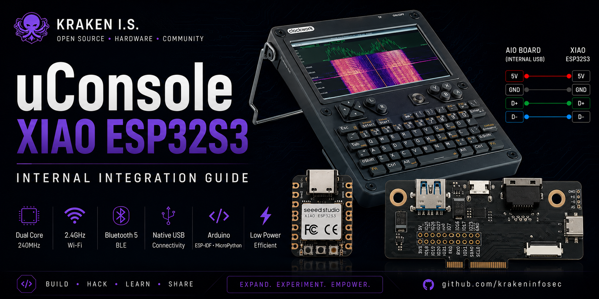
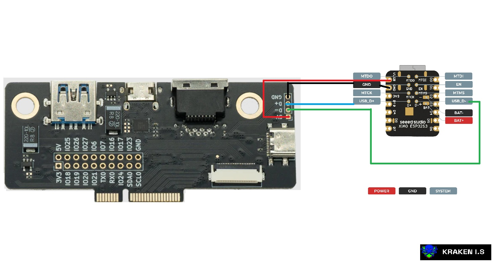

<p align="center">
  
</p>

#̑̇̈ ̑̇̈ȗ̇̈C̑̇̈ȏ̇̈n̑̇̈s̑̇̈ȏ̇̈l̑̇̈ȇ̇̈ ̑̇̈X̑̇̈Ȋ̇̈Ȃ̇̈Ȏ̇̈ ̑̇̈Ȇ̇̈S̑̇̈P̑̇̈3̑̇̈2̑̇̈S̑̇̈3̑̇̈
̑̇̈
̑̇̈>̑̇̈ ̑̇̈Ȋ̇̈n̑̇̈t̑̇̈ȇ̇̈ȓ̇̈n̑̇̈ȃ̇̈l̑̇̈ ̑̇̈ȋ̇̈n̑̇̈t̑̇̈ȇ̇̈g̑̇̈ȓ̇̈ȃ̇̈t̑̇̈ȋ̇̈ȏ̇̈n̑̇̈ ̑̇̈g̑̇̈ȗ̇̈ȋ̇̈d̑̇̈ȇ̇̈ ̑̇̈f̑̇̈ȏ̇̈ȓ̇̈ ̑̇̈t̑̇̈h̑̇̈ȇ̇̈ ̑̇̈C̑̇̈l̑̇̈ȏ̇̈c̑̇̈k̑̇̈w̑̇̈ȏ̇̈ȓ̇̈k̑̇̈ ̑̇̈ȗ̇̈C̑̇̈ȏ̇̈n̑̇̈s̑̇̈ȏ̇̈l̑̇̈ȇ̇̈ ̑̇̈ȗ̇̈s̑̇̈ȋ̇̈n̑̇̈g̑̇̈ ̑̇̈t̑̇̈h̑̇̈ȇ̇̈ ̑̇̈S̑̇̈ȇ̇̈ȇ̇̈ȇ̇̈d̑̇̈ ̑̇̈S̑̇̈t̑̇̈ȗ̇̈d̑̇̈ȋ̇̈ȏ̇̈ ̑̇̈X̑̇̈Ȋ̇̈Ȃ̇̈Ȏ̇̈ ̑̇̈Ȇ̇̈S̑̇̈P̑̇̈3̑̇̈2̑̇̈S̑̇̈3̑̇̈.̑̇̈

(っ◔◡◔)っ  ------------------------------------------------------------------------------ (っ◔◡◔)っ

## 𝑾𝙝𝒚 𝐀𝐝𝑑 𝗮𝑛 𝐸𝑺𝘗32 𝑰𝗻𝘴𝒊𝙙𝒆 𝑡𝗵𝘦 𝘶𝘾𝒐𝙣𝐬𝒐𝘭𝑒?

𝑻𝘩𝑒 𝘾𝗹𝘰𝒄𝑘𝘸𝒐𝘳𝑘 𝐮𝗖𝗼𝑛𝐬𝐨𝑙𝒆 𝗶𝘀 𝘢𝙡𝑟𝙚𝒂𝐝𝒚 𝒂 𝒑𝗼𝑤𝐞𝙧𝑓𝐮𝘭 𝐩𝑜𝑟𝑡𝑎𝒃𝐥𝗲 𝗟𝙞𝗻𝒖𝑥 𝗰𝙤𝗺𝘱𝘶𝘁𝐞𝒓, 𝒎𝘢𝒌𝘪𝑛𝘨 𝐢𝘵 𝐚𝒏 𝘦𝒙𝘤𝙚𝐥𝐥𝒆𝑛𝙩 𝘱𝑙𝐚𝐭𝘧𝐨𝐫𝑚 𝒇𝘰𝗿 𝒅𝑒𝑣𝙚𝗹𝗼𝑝𝗺𝑒𝙣𝘵, 𝙘𝒚𝐛𝑒𝑟𝐬𝗲𝐜𝘶𝐫𝙞𝐭𝙮, 𝙎𝗗𝑅, 𝗮𝙣𝘥 𝙚𝒎𝘣𝒆𝑑𝑑𝘦𝐝 𝑝𝐫𝘰𝐣𝐞𝘤𝘁𝑠. 𝙃𝗼𝙬𝐞𝐯𝑒𝑟, 𝒎𝘢𝘯𝑦 𝘩𝗮𝑟𝘥𝐰𝐚𝘳𝑒-𝘧𝒐𝐜𝘶𝐬𝑒𝘥 𝗮𝒑𝘱𝒍𝘪𝐜𝒂𝘁𝐢𝗼𝒏𝒔 𝘴𝑡𝒊𝘭𝑙 𝘣𝐞𝒏𝐞𝙛𝘪𝒕 𝒇𝘳𝘰𝙢 𝘩𝑎𝐯𝗶𝑛𝐠 𝗮 𝑑𝑒𝐝𝘪𝒄𝘢𝘵𝗲𝗱 𝒎𝑖𝐜𝙧𝒐𝙘𝗼𝒏𝐭𝗿𝐨𝘭𝑙𝒆𝗿 𝘧𝒐𝗿 𝐡𝑎𝗻𝙙𝘭𝗶𝗻𝙜 𝒓𝑒𝗮𝙡-𝐭𝐢𝒎𝙚 𝙩𝗮𝒔𝐤𝐬, 𝘄𝐢𝐫𝘦𝐥𝒆𝘴𝐬 𝗰𝑜𝒎𝒎𝙪𝗻𝘪𝗰𝒂𝘵𝐢𝘰𝙣, 𝙖𝒏𝙙 𝗱𝙞𝘳𝐞𝙘𝙩 𝒉𝒂𝗿𝗱𝙬𝐚𝘳𝑒 𝗶𝐧𝑡𝙚𝗿𝑎𝗰𝘁𝘪𝘰𝑛.

𝐈𝗻𝒔𝐭𝗲𝐚𝗱 𝐨𝘧 𝐜𝑎𝒓𝗿𝙮𝒊𝙣𝗴 𝑎𝐧 𝑒𝒙𝘁𝒆𝐫𝘯𝐚𝙡 𝙙𝙚𝘃𝘦𝐥𝗼𝐩𝗺𝙚𝑛𝐭 𝙗𝑜𝘢𝐫𝐝 𝘤𝙤𝑛𝗻𝗲𝑐𝘵𝒆𝗱 𝒐𝘃𝙚𝗿 𝗨𝐒𝐵, 𝑡𝘩𝙞𝐬 𝗽𝐫𝑜𝘫𝘦𝗰𝒕 𝐢𝗻𝒕𝙚𝒈𝘳𝐚𝑡𝙚𝘴 𝑎 **𝐒𝒆𝗲𝑒𝑑 𝐒𝑡𝐮𝘥𝐢𝘰 𝘟𝗜𝗔𝑶 𝗘𝗦𝘗3𝟮𝐒3** 𝙙𝗶𝑟𝘦𝘤𝑡𝒍𝙮 𝐢𝙣𝘴𝑖𝘥𝘦 𝒕ℎ𝒆 𝐮𝘊𝗼𝙣𝐬𝒐𝒍𝗲 𝘂𝘴𝘪𝘯𝒈 𝘵𝐡𝒆 𝙞𝗻𝘁𝒆𝙧𝙣𝑎𝑙 𝑈𝑆𝐵 𝘩𝐞𝒂𝑑𝑒𝑟 𝘢𝑣𝒂𝙞𝗹𝘢𝘣𝘭𝐞 𝙤𝗻 𝐭ℎ𝑒 **𝘏𝐚𝙘𝘬𝘦𝒓𝐺𝐚𝙙𝐠𝙚𝐭𝘀 𝐴𝑰𝘖 𝗕𝒐𝙖𝑟𝒅** (𝐨𝙧 𝐄𝘹𝗽𝑎𝐧𝒔𝑖𝘰𝑛 𝘉𝒐𝘢𝐫𝘥).

𝗪𝒊𝙩𝘩 𝗼𝒏𝗹𝒚 𝐟𝗼𝘂𝐫 𝘜𝑺𝐁 𝐜𝐨𝘯𝙣𝙚𝐜𝐭𝑖𝙤𝐧𝐬—**5𝐕, 𝑮𝙉𝘿, 𝘿+, 𝗮𝘯𝑑 𝑫−**—𝙩𝐡𝘦 𝐄𝙎𝐏32𝗦3 𝒃𝙚𝗰𝒐𝘮𝐞𝑠 𝑎 𝒑𝐞𝘳𝙢𝐚𝗻𝑒𝒏𝑡 𝑝𝗮𝐫𝒕 𝐨𝗳 𝐭𝐡𝐞 𝗱𝘦𝒗𝐢𝐜𝐞, 𝙥𝗿𝗼𝙫𝑖𝐝𝐢𝗻𝘨 𝒂 𝐜𝗹𝒆𝒂𝑛, 𝑐𝒐𝐦𝙥𝒂𝘤𝐭, 𝑎𝙣𝗱 𝑟𝙚𝙡𝘪𝐚𝗯𝘭𝒆 𝘴𝗼𝐥𝐮𝘁𝗶𝗼𝐧 𝐟𝙤𝐫 𝐟𝘂𝒕𝘂𝘳𝐞 𝘩𝑎𝐫𝑑𝘄𝙖𝙧𝘦 𝙚𝘹𝒑𝙖𝙣𝒔𝐢𝗼𝐧𝘴.


## 𝙒ℎ𝘆 𝗖𝐡𝘰𝒐𝘀𝘦 𝘵𝗵𝘦 𝑆𝘦𝙚𝘦𝗱 𝐒𝐭𝙪𝘥𝘪𝐨 𝑋𝙄𝘈𝗢 𝘌𝙎𝗣3𝟮𝐒𝟯?

𝑇𝘩𝐞𝑟𝐞 𝑎𝐫𝗲 𝐦𝙖𝑛𝘆 𝑬𝘚𝑷3𝟐 𝑑𝘦𝒗𝐞𝗹𝙤𝗽𝐦𝐞𝑛𝒕 𝒃𝙤𝘢𝐫𝙙𝙨 𝑎𝑣𝑎𝑖𝙡𝐚𝙗𝗹𝒆, 𝙗𝘂𝙩 𝐟𝐨𝑟 𝙖𝒏 𝘪𝐧𝘁𝑒𝙧𝗻𝙖𝘭 𝒖𝐂𝘰𝑛𝘴𝐨𝒍𝗲 𝑖𝑛𝙨𝘁𝐚𝒍𝒍𝗮𝘵𝒊𝗼𝘯, 𝑡𝒉𝗲 **𝐒𝙚𝙚𝗲𝗱 𝙎𝑡𝑢𝙙𝐢𝐨 𝘟𝘐𝘼𝗢 𝙀𝙎𝘗32𝑺3** 𝙨𝐭𝑎𝑛𝗱𝙨 𝒐𝒖𝐭 𝒂𝑠 𝙤𝐧𝘦 𝙤𝘧 𝒕𝙝𝒆 𝑏𝒆𝐬𝐭 𝙘𝗵𝑜𝙞𝑐𝘦𝑠.

𝙄𝘵𝑠 𝒖𝑙𝒕𝑟𝙖-𝙘𝑜𝘮𝘱𝗮𝒄𝒕 𝗱𝑒𝘴𝗶𝘨𝑛 𝑎𝗹𝐥𝙤𝘸𝘀 𝐢𝙩 𝐭𝗼 𝙛𝒊𝙩 𝗻𝐞𝘢𝑡𝘭𝘺 𝒊𝒏𝘀𝘪𝒅𝗲 𝑡ℎ𝘦 𝘶𝑪𝐨𝑛𝘀𝗼𝙡𝘦 𝙬𝐢𝑡𝐡𝙤𝙪𝘵 𝘳𝑒𝐪𝘂𝗶𝐫𝘪𝗻𝘨 𝗺𝗮𝙟𝘰𝗿 𝑚𝙤𝐝𝗶𝘧𝘪𝙘𝐚𝘁𝐢𝐨𝑛𝐬, 𝐰𝙝𝑖𝙡𝗲 𝘴𝐭𝗶𝒍𝘭 𝙥𝑟𝑜𝑣𝐢𝐝𝒊𝑛𝒈 𝘁𝒉𝒆 𝒇𝙪𝐥𝑙 𝙥𝘦𝗿𝘧𝑜𝐫𝘮𝒂𝗻𝐜𝒆 𝙤𝘧 𝐭𝙝𝑒 𝗘𝘚𝑃32-𝐒𝟯 𝐩𝗹𝗮𝘁𝙛𝘰𝗿𝗺.

### 𝗞𝗲𝐲 𝗔𝘥𝘷𝐚𝗻𝘁𝙖𝗴𝗲𝒔

- 📏 𝑈𝙡𝒕𝑟𝗮-𝐜𝗼𝙢𝘱𝘢𝙘𝘁 𝗳𝒐𝙧𝒎 𝐟𝒂𝙘𝙩𝗼𝒓 (21 × 1𝟳.8 𝑚𝘮)
- ⚡ 𝗗𝑢𝑎𝘭-𝘤𝘰𝘳𝑒 𝙓𝙩𝙚𝒏𝑠𝒂 𝐿𝘟𝟕 𝐩𝐫𝐨𝙘𝗲𝐬𝘴𝙤𝐫 𝗿𝘂𝒏𝙣𝑖𝒏𝐠 𝑢𝑝 𝘵𝑜 24𝟬 𝐌𝐻𝑧
- 📶 𝐵𝙪𝐢𝙡𝒕-𝒊𝑛 𝟐.4 𝑮𝑯𝘻 𝗪𝙞-𝙁𝒊
- 📡 𝘽𝘭𝘶𝗲𝘁𝐨𝗼𝒕𝐡 𝟓 𝙇𝗼𝑤 𝐸𝒏𝒆𝘳𝗴𝐲 (𝘉𝐿𝘌)
- 🔌 𝙉𝒂𝐭𝒊𝘃𝑒 𝑼𝑺𝐁 𝐬𝘶𝒑𝒑𝙤𝘳𝒕 𝙛𝘰𝘳 𝙚𝙖𝒔𝘺 𝑖𝐧𝒕𝗲𝒈𝘳𝗮𝙩𝗶𝒐𝘯
- 💾 8 𝙈𝘽 𝗙𝘭𝙖𝑠𝙝 + 8 𝑀𝐵 𝐏𝑆𝗥𝘼𝙈
- 🛠 𝘊𝗼𝒎𝘱𝗮𝙩𝐢𝒃𝒍𝒆 𝘄𝗶𝙩𝒉 𝑨𝒓𝗱𝘂𝒊𝐧𝒐, 𝐸𝘚𝗣-𝗜𝘋𝗙, 𝗮𝐧𝘥 𝑀𝐢𝙘𝗿𝐨𝘗𝐲𝒕𝒉𝗼𝘯
- 🔋 𝗟𝑜𝐰 𝘱𝘰𝙬𝗲𝒓 𝐜𝙤𝒏𝒔𝐮𝑚𝑝𝐭𝘪𝗼𝒏 𝒘𝙞𝘁𝒉 𝐦𝘶𝑙𝒕𝑖𝗽𝒍𝘦 𝐬𝐥𝒆𝘦𝑝 𝗺𝙤𝙙𝗲𝑠
- 🌍 𝐄𝒙𝑐𝙚𝐥𝐥𝗲𝒏𝘁 𝙘𝙤𝐦𝐦𝙪𝒏𝗶𝐭𝙮 𝐬𝙪𝙥𝑝𝙤𝐫𝐭 𝘢𝙣𝐝 𝙙𝑜𝐜𝘂𝒎𝑒𝘯𝑡𝗮𝒕𝒊𝘰𝘯

𝙁𝙤𝑟 𝐩𝗼𝑟𝐭𝗮𝒃𝑙𝐞 𝐞𝒎𝗯𝗲𝗱𝒅𝗲𝘥 𝙥𝑟𝒐𝑗𝑒𝗰𝑡𝘴, 𝘵𝒉𝐞𝒔𝙚 𝒇𝙚𝒂𝘵𝘂𝘳𝗲𝑠 𝑚𝗮𝙠𝑒 𝒕ℎ𝗲 𝑿𝑰𝑨𝑂 𝙀𝐒𝙋32𝐒3 𝐚𝑛 𝗲𝘹𝒄𝒆𝒍𝐥𝙚𝒏𝘵 𝑐𝐨𝘮𝘱𝗮𝗻𝐢𝒐𝘯 𝑓𝒐𝑟 𝙩𝙝𝘦 𝐮𝐂𝐨𝗻𝑠𝘰𝒍𝒆 𝘸𝙝𝗶𝐥𝗲 𝑘𝙚𝒆𝗽𝐢𝙣𝑔 𝑡ℎ𝐞 𝑒𝒏𝒕𝒊𝙧𝘦 𝒃𝘂𝙞𝒍𝘥 𝗰𝒐𝘮𝐩𝐚𝑐𝑡 𝘢𝗻𝑑 𝑚𝘰𝙙𝙪𝐥𝘢𝘳.

## 𝑾𝒉𝒂𝒕 𝑫𝒐𝒆𝒔 𝑻𝒉𝒊𝒔 𝑨𝒅𝒅 𝒕𝒐 𝒕𝒉𝒆 𝒖𝑪𝒐𝒏𝒔𝒐𝒍𝒆?

𝑩𝒚 𝒊𝒏𝒕𝒆𝒈𝒓𝒂𝒕𝒊𝒏𝒈 𝒕𝒉𝒆 𝑿𝑰𝑨𝑶 𝑬𝑺𝑷32𝑺3 𝒊𝒏𝒕𝒆𝒓𝒏𝒂𝒍𝒍𝒚, 𝒕𝒉𝒆 𝒖𝑪𝒐𝒏𝒔𝒐𝒍𝒆 𝒃𝒆𝒄𝒐𝒎𝒆𝒔 𝒎𝒐𝒓𝒆 𝒕𝒉𝒂𝒏 𝒋𝒖𝒔𝒕 𝒂 𝒑𝒐𝒓𝒕𝒂𝒃𝒍𝒆 𝑳𝒊𝒏𝒖𝒙 𝒄𝒐𝒎𝒑𝒖𝒕𝒆𝒓—𝒊𝒕 𝒃𝒆𝒄𝒐𝒎𝒆𝒔 𝒂 𝒎𝒐𝒅𝒖𝒍𝒂𝒓 𝒉𝒂𝒓𝒅𝒘𝒂𝒓𝒆 𝒅𝒆𝒗𝒆𝒍𝒐𝒑𝒎𝒆𝒏𝒕 𝒑𝒍𝒂𝒕𝒇𝒐𝒓𝒎.

𝑻𝒉𝒆 𝑬𝑺𝑷32𝑺3 𝒉𝒂𝒏𝒅𝒍𝒆𝒔 𝒓𝒆𝒂𝒍-𝒕𝒊𝒎𝒆 𝒉𝒂𝒓𝒅𝒘𝒂𝒓𝒆 𝒄𝒐𝒏𝒕𝒓𝒐𝒍 𝒂𝒏𝒅 𝒘𝒊𝒓𝒆𝒍𝒆𝒔𝒔 𝒄𝒐𝒎𝒎𝒖𝒏𝒊𝒄𝒂𝒕𝒊𝒐𝒏, 𝒘𝒉𝒊𝒍𝒆 𝒕𝒉𝒆 𝑹𝒂𝒔𝒑𝒃𝒆𝒓𝒓𝒚 𝑷𝒊 𝑪𝒐𝒎𝒑𝒖𝒕𝒆 𝑴𝒐𝒅𝒖𝒍𝒆 𝒊𝒏𝒔𝒊𝒅𝒆 𝒕𝒉𝒆 𝒖𝑪𝒐𝒏𝒔𝒐𝒍𝒆 𝒄𝒐𝒏𝒕𝒊𝒏𝒖𝒆𝒔 𝒓𝒖𝒏𝒏𝒊𝒏𝒈 𝑳𝒊𝒏𝒖𝒙 𝒂𝒑𝒑𝒍𝒊𝒄𝒂𝒕𝒊𝒐𝒏𝒔. 𝑻𝒐𝒈𝒆𝒕𝒉𝒆𝒓, 𝒕𝒉𝒆𝒚 𝒄𝒓𝒆𝒂𝒕𝒆 𝒂 𝒑𝒐𝒘𝒆𝒓𝒇𝒖𝒍 𝒄𝒐𝒎𝒃𝒊𝒏𝒂𝒕𝒊𝒐𝒏 𝒇𝒐𝒓 𝒆𝒎𝒃𝒆𝒅𝒅𝒆𝒅 𝒅𝒆𝒗𝒆𝒍𝒐𝒑𝒎𝒆𝒏𝒕, 𝒄𝒚𝒃𝒆𝒓𝒔𝒆𝒄𝒖𝒓𝒊𝒕𝒚 𝒓𝒆𝒔𝒆𝒂𝒓𝒄𝒉, 𝒂𝒏𝒅 𝒑𝒐𝒓𝒕𝒂𝒃𝒍𝒆 𝒇𝒊𝒆𝒍𝒅 𝒘𝒐𝒓𝒌.

### 𝑷𝒐𝒕𝒆𝒏𝒕𝒊𝒂𝒍 𝑨𝒑𝒑𝒍𝒊𝒄𝒂𝒕𝒊𝒐𝒏𝒔

- 📶 𝑾𝒊-𝑭𝒊 𝒖𝒕𝒊𝒍𝒊𝒕𝒊𝒆𝒔 𝒂𝒏𝒅 𝒏𝒆𝒕𝒘𝒐𝒓𝒌 𝒔𝒄𝒂𝒏𝒏𝒊𝒏𝒈
- 📡 𝑩𝒍𝒖𝒆𝒕𝒐𝒐𝒕𝒉 𝑳𝒐𝒘 𝑬𝒏𝒆𝒓𝒈𝒚 (𝑩𝑳𝑬) 𝒆𝒙𝒑𝒆𝒓𝒊𝒎𝒆𝒏𝒕𝒔
- 🔌 𝑼𝑺𝑩 𝒔𝒆𝒓𝒊𝒂𝒍 𝒃𝒓𝒊𝒅𝒈𝒆 𝒃𝒆𝒕𝒘𝒆𝒆𝒏 𝑳𝒊𝒏𝒖𝒙 𝒂𝒏𝒅 𝑬𝑺𝑷32
- 🌡 𝑺𝒆𝒏𝒔𝒐𝒓 𝒊𝒏𝒕𝒆𝒈𝒓𝒂𝒕𝒊𝒐𝒏 (𝑰2𝑪, 𝑺𝑷𝑰, 𝑼𝑨𝑹𝑻)
- 📍 𝑮𝑷𝑺 𝒅𝒂𝒕𝒂 𝒄𝒐𝒍𝒍𝒆𝒄𝒕𝒊𝒐𝒏 𝒂𝒏𝒅 𝒍𝒐𝒈𝒈𝒊𝒏𝒈
- 🏠 𝑯𝒐𝒎𝒆 𝑨𝒔𝒔𝒊𝒔𝒕𝒂𝒏𝒕 𝒂𝒏𝒅 𝑴𝑸𝑻𝑻 𝒊𝒏𝒕𝒆𝒈𝒓𝒂𝒕𝒊𝒐𝒏
- 🤖 𝑹𝒐𝒃𝒐𝒕𝒊𝒄𝒔 𝒂𝒏𝒅 𝒉𝒂𝒓𝒅𝒘𝒂𝒓𝒆 𝒂𝒖𝒕𝒐𝒎𝒂𝒕𝒊𝒐𝒏
- 📊 𝑹𝒆𝒂𝒍-𝒕𝒊𝒎𝒆 𝒅𝒂𝒕𝒂 𝒂𝒄𝒒𝒖𝒊𝒔𝒊𝒕𝒊𝒐𝒏
- 🛠 𝑪𝒖𝒔𝒕𝒐𝒎 𝒆𝒎𝒃𝒆𝒅𝒅𝒆𝒅 𝒅𝒆𝒗𝒆𝒍𝒐𝒑𝒎𝒆𝒏𝒕
- 🔋 𝑩𝒂𝒕𝒕𝒆𝒓𝒚 𝒂𝒏𝒅 𝒑𝒐𝒘𝒆𝒓 𝒎𝒐𝒏𝒊𝒕𝒐𝒓𝒊𝒏𝒈
- 🌐 𝑷𝒐𝒓𝒕𝒂𝒃𝒍𝒆 𝑰𝒐𝑻 𝒈𝒂𝒕𝒆𝒘𝒂𝒚
- 🔬 𝑹𝒂𝒑𝒊𝒅 𝒑𝒓𝒐𝒕𝒐𝒕𝒚𝒑𝒊𝒏𝒈 𝒇𝒐𝒓 𝒆𝒍𝒆𝒄𝒕𝒓𝒐𝒏𝒊𝒄𝒔 𝒑𝒓𝒐𝒋𝒆𝒄𝒕𝒔

𝑹𝒂𝒕𝒉𝒆𝒓 𝒕𝒉𝒂𝒏 𝒄𝒐𝒏𝒏𝒆𝒄𝒕𝒊𝒏𝒈 𝒂𝒏 𝒆𝒙𝒕𝒆𝒓𝒏𝒂𝒍 𝑬𝑺𝑷32 𝒃𝒐𝒂𝒓𝒅 𝒆𝒗𝒆𝒓𝒚 𝒕𝒊𝒎𝒆, 𝒕𝒉𝒆 𝒎𝒊𝒄𝒓𝒐𝒄𝒐𝒏𝒕𝒓𝒐𝒍𝒍𝒆𝒓 𝒊𝒔 𝒂𝒍𝒘𝒂𝒚𝒔 𝒂𝒗𝒂𝒊𝒍𝒂𝒃𝒍𝒆 𝒊𝒏𝒔𝒊𝒅𝒆 𝒕𝒉𝒆 𝒅𝒆𝒗𝒊𝒄𝒆, 𝒎𝒂𝒌𝒊𝒏𝒈 𝒇𝒖𝒕𝒖𝒓𝒆 𝒑𝒓𝒐𝒋𝒆𝒄𝒕𝒔 𝒄𝒍𝒆𝒂𝒏𝒆𝒓, 𝒇𝒂𝒔𝒕𝒆𝒓, 𝒂𝒏𝒅 𝒎𝒐𝒓𝒆 𝒑𝒐𝒓𝒕𝒂𝒃𝒍𝒆.

## 𝙋𝙧𝙤𝙟𝙚𝙘𝙩 𝙂𝙤𝙖𝙡𝙨

𝙏𝙝𝙞𝙨 𝙥𝙧𝙤𝙟𝙚𝙘𝙩 𝙞𝙨 𝙣𝙤𝙩 𝙟𝙪𝙨𝙩 𝙖𝙗𝙤𝙪𝙩 𝙞𝙣𝙨𝙩𝙖𝙡𝙡𝙞𝙣𝙜 𝙖𝙣 𝙀𝙎𝙋32𝙎3 𝙞𝙣𝙨𝙞𝙙𝙚 𝙩𝙝𝙚 𝙪𝘾𝙤𝙣𝙨𝙤𝙡𝙚.

𝙏𝙝𝙚 𝙜𝙤𝙖𝙡 𝙞𝙨 𝙩𝙤 𝙗𝙪𝙞𝙡𝙙 𝙖 𝙜𝙧𝙤𝙬𝙞𝙣𝙜 𝙘𝙤𝙡𝙡𝙚𝙘𝙩𝙞𝙤𝙣 𝙤𝙛 𝙝𝙖𝙧𝙙𝙬𝙖𝙧𝙚 𝙢𝙤𝙙𝙞𝙛𝙞𝙘𝙖𝙩𝙞𝙤𝙣𝙨, 𝙛𝙞𝙧𝙢𝙬𝙖𝙧𝙚, 𝙖𝙣𝙙 𝙥𝙧𝙖𝙘𝙩𝙞𝙘𝙖𝙡 𝙥𝙧𝙤𝙟𝙚𝙘𝙩𝙨 𝙩𝙝𝙖𝙩 𝙚𝙭𝙥𝙖𝙣𝙙 𝙩𝙝𝙚 𝙘𝙖𝙥𝙖𝙗𝙞𝙡𝙞𝙩𝙞𝙚𝙨 𝙤𝙛 𝙩𝙝𝙚 𝙪𝘾𝙤𝙣𝙨𝙤𝙡𝙚.

𝙀𝙫𝙚𝙧𝙮 𝙛𝙪𝙩𝙪𝙧𝙚 𝙛𝙚𝙖𝙩𝙪𝙧𝙚 𝙖𝙣𝙙 𝙚𝙭𝙥𝙚𝙧𝙞𝙢𝙚𝙣𝙩 𝙬𝙞𝙡𝙡 𝙗𝙚 𝙙𝙤𝙘𝙪𝙢𝙚𝙣𝙩𝙚𝙙 𝙝𝙚𝙧𝙚, 𝙢𝙖𝙠𝙞𝙣𝙜 𝙩𝙝𝙞𝙨 𝙧𝙚𝙥𝙤𝙨𝙞𝙩𝙤𝙧𝙮 𝙖 𝙘𝙚𝙣𝙩𝙧𝙖𝙡 𝙧𝙚𝙨𝙤𝙪𝙧𝙘𝙚 𝙛𝙤𝙧 𝙖𝙣𝙮𝙤𝙣𝙚 𝙞𝙣𝙩𝙚𝙧𝙚𝙨𝙩𝙚𝙙 𝙞𝙣 𝙝𝙖𝙧𝙙𝙬𝙖𝙧𝙚 𝙝𝙖𝙘𝙠𝙞𝙣𝙜 𝙖𝙣𝙙 𝙚𝙢𝙗𝙚𝙙𝙙𝙚𝙙 𝙙𝙚𝙫𝙚𝙡𝙤𝙥𝙢𝙚𝙣𝙩 𝙤𝙣 𝙩𝙝𝙚 𝙪𝘾𝙤𝙣𝙨𝙤𝙡𝙚.

## 𝗛𝗮𝗿𝗱𝘄𝗮𝗿𝗲 𝗥𝗲𝗾𝘂𝗶𝗿𝗲𝗱

𝗢𝗻𝗹𝘆 𝗮 𝗳𝗲𝘄 𝗰𝗼𝗺𝗽𝗼𝗻𝗲𝗻𝘁𝘀 𝗮𝗿𝗲 𝗻𝗲𝗲𝗱𝗲𝗱 𝘁𝗼 𝗰𝗼𝗺𝗽𝗹𝗲𝘁𝗲 𝘁𝗵𝗶𝘀 𝗺𝗼𝗱𝗶𝗳𝗶𝗰𝗮𝘁𝗶𝗼𝗻:

- 𝗦𝗲𝗲𝗲𝗱 𝗦𝘁𝘂𝗱𝗶𝗼 𝗫𝗜𝗔𝗢 𝗘𝗦𝗣𝟯𝟮𝗦𝟯
- 𝗔𝗻𝘆 𝗛𝗮𝗰𝗸𝗲𝗿𝗚𝗮𝗱𝗴𝗲𝘁𝘀 𝗔𝗜𝗢 𝗼𝗿 𝗘𝘅𝗽𝗮𝗻𝘀𝗶𝗼𝗻 𝗕𝗼𝗮𝗿𝗱 𝘄𝗶𝘁𝗵 𝘁𝗵𝗲 𝗶𝗻𝘁𝗲𝗿𝗻𝗮𝗹 𝗨𝗦𝗕 𝗵𝗲𝗮𝗱𝗲𝗿
- 𝗙𝗼𝘂𝗿 𝘀𝗵𝗼𝗿𝘁 𝘄𝗶𝗿𝗲𝘀 (𝟱𝗩, 𝗚𝗡𝗗, 𝗗+, 𝗮𝗻𝗱 𝗗−)
- 𝗙𝗶𝗻𝗲-𝘁𝗶𝗽 𝘀𝗼𝗹𝗱𝗲𝗿𝗶𝗻𝗴 𝗶𝗿𝗼𝗻
- 𝗦𝗼𝗹𝗱𝗲𝗿

𝗧𝗵𝗮𝘁'𝘀 𝗶𝘁—𝗻𝗼 𝗮𝗱𝗱𝗶𝘁𝗶𝗼𝗻𝗮𝗹 𝗨𝗦𝗕 𝗮𝗱𝗮𝗽𝘁𝗲𝗿𝘀 𝗼𝗿 𝗲𝘅𝘁𝗲𝗿𝗻𝗮𝗹 𝗰𝗮𝗯𝗹𝗲𝘀 𝗮𝗿𝗲 𝗿𝗲𝗾𝘂𝗶𝗿𝗲𝗱. 𝗢𝗻𝗰𝗲 𝘁𝗵𝗲 𝗳𝗼𝘂𝗿 𝗨𝗦𝗕 𝗰𝗼𝗻𝗻𝗲𝗰𝘁𝗶𝗼𝗻𝘀 𝗮𝗿𝗲 𝘀𝗼𝗹𝗱𝗲𝗿𝗲𝗱, 𝘁𝗵𝗲 𝗫𝗜𝗔𝗢 𝗘𝗦𝗣𝟯𝟮𝗦𝟯 𝗯𝗲𝗰𝗼𝗺𝗲𝘀 𝗮𝗻 𝗶𝗻𝘁𝗲𝗿𝗻𝗮𝗹 𝗨𝗦𝗕 𝗱𝗲𝘃𝗶𝗰𝗲 𝗶𝗻𝘀𝗶𝗱𝗲 𝘁𝗵𝗲 𝘂𝗖𝗼𝗻𝘀𝗼𝗹𝗲, 𝗿𝗲𝗮𝗱𝘆 𝗳𝗼𝗿 𝗳𝘂𝘁𝘂𝗿𝗲 𝗱𝗲𝘃𝗲𝗹𝗼𝗽𝗺𝗲𝗻𝘁 𝗮𝗻𝗱 𝗲𝘅𝗽𝗮𝗻𝘀𝗶𝗼𝗻.


## 𝑮𝒂𝒍𝒍𝒆𝒓𝒚

## 🔌 USB Wiring Diagram

The diagram below shows the required USB connections between the **HackerGadgets AIO/Expansion Board** and the **Seeed Studio XIAO ESP32S3**.

<p align="center">
  
</p>

Only **four wires** are required to complete the USB connection.

| AIO / Expansion Board | XIAO ESP32S3 |
| :-------------------: | :----------: |
| 5V                    | 5V           |
| GND                   | GND          |
| D+                    | D+           |
| D−                    | D−           |

After soldering these four connections, the XIAO ESP32S3 is detected by Linux as a native USB device and is ready for firmware development and future hardware expansion.


𝑶𝒏𝒄𝒆 𝒄𝒐𝒏𝒏𝒆𝒄𝒕𝒆𝒅, 𝑳𝒊𝒏𝒖𝒙 𝒅𝒆𝒕𝒆𝒄𝒕𝒔 𝒕𝒉𝒆 𝒃𝒐𝒂𝒓𝒅 𝒂𝒖𝒕𝒐𝒎𝒂𝒕𝒊𝒄𝒂𝒍𝒍𝒚 𝒂𝒔 𝒂𝒏 𝑬𝒔𝒑𝒓𝒆𝒔𝒔𝒊𝒇 𝑼𝑺𝑩 𝑱𝑻𝑨𝑮/𝑺𝒆𝒓𝒊𝒂𝒍 𝒅𝒆𝒗𝒊𝒄𝒆.


---

### 🔍 Verifying Your Installation

Once the XIAO ESP32S3 is connected, it's a good idea to verify that the board is detected correctly before moving on to future projects.

### Standard USB Check

Run the following command:

```bash
lsusb
```

If the installation was successful, you should see an entry similar to:

```text
Espressif USB JTAG/Serial Debug Unit
```

<p align="center">
  
</p>

---

## ⚙️ HackerGadgets AIO v2 Verification

If you're using the **HackerGadgets AIO v2 Board**, you can verify the status of all onboard hardware using **aiov2_ctl**.

Display the current board status:

```bash
sudo python3 aiov2_ctl.py --status
```

Or, if **aiov2_ctl** is installed system-wide:

```bash
aiov2_ctl --status
```

This command shows the current status of:

- GPS
- LoRa
- SDR
- Internal USB
- Battery information
- Power usage

Example output:

```text
GPS   : OFF
LoRa  : OFF
SDR   : OFF
USB   : ON
```

---

## 🎛️ Enable or Disable Hardware

Turn a module **ON**:

```bash
aiov2_ctl GPS on
aiov2_ctl LORA on
aiov2_ctl SDR on
aiov2_ctl USB on
```

Turn a module **OFF**:

```bash
aiov2_ctl GPS off
aiov2_ctl LORA off
aiov2_ctl SDR off
aiov2_ctl USB off
```

---

## ⚡ Live Monitoring

Monitor power usage in real time:

```bash
aiov2_ctl --power
```

Watch the current GPIO and hardware state:

```bash
aiov2_ctl --watch
```

---

## 📝 Quick Reference

| Command | Description |
|---------|-------------|
| `lsusb` | Verify that Linux detects the ESP32S3 |
| `aiov2_ctl --status` | Show the current AIO v2 status |
| `aiov2_ctl GPS on` | Enable the GPS module |
| `aiov2_ctl LORA on` | Enable the LoRa module |
| `aiov2_ctl SDR on` | Enable the SDR module |
| `aiov2_ctl USB on` | Enable the internal USB rail |
| `aiov2_ctl --power` | Monitor live power usage |
| `aiov2_ctl --watch` | Watch GPIO and hardware status in real time |

> **Note**
>
> On the AIO v2 Board, some hardware modules are powered off by default. If a device isn't detected, check its status with `aiov2_ctl --status` before troubleshooting drivers or hardware connections.


## 🚧 𝑹𝒐𝒂𝒅𝒎𝒂𝒑

𝑻𝒉𝒊𝒔 𝒓𝒆𝒑𝒐𝒔𝒊𝒕𝒐𝒓𝒚 𝒊𝒔 𝒂𝒄𝒕𝒊𝒗𝒆𝒍𝒚 𝒖𝒏𝒅𝒆𝒓 𝒅𝒆𝒗𝒆𝒍𝒐𝒑𝒎𝒆𝒏𝒕.

𝑼𝒑𝒄𝒐𝒎𝒊𝒏𝒈 𝒂𝒅𝒅𝒊𝒕𝒊𝒐𝒏𝒔 𝒊𝒏𝒄𝒍𝒖𝒅𝒆:

- 𝑾𝒊-𝑭𝒊 𝒖𝒕𝒊𝒍𝒊𝒕𝒊𝒆𝒔
- 𝑩𝑳𝑬 𝒕𝒐𝒐𝒍𝒔
- 𝑮𝑷𝑰𝑶 𝒆𝒙𝒂𝒎𝒑𝒍𝒆𝒔
- 𝑭𝒊𝒓𝒎𝒘𝒂𝒓𝒆 𝒆𝒙𝒂𝒎𝒑𝒍𝒆𝒔
- 𝑯𝒂𝒓𝒅𝒘𝒂𝒓𝒆 𝒎𝒐𝒅𝒊𝒇𝒊𝒄𝒂𝒕𝒊𝒐𝒏𝒔
- 𝑷𝒆𝒓𝒇𝒐𝒓𝒎𝒂𝒏𝒄𝒆 𝒃𝒆𝒏𝒄𝒉𝒎𝒂𝒓𝒌𝒔
- 𝑨𝒅𝒅𝒊𝒕𝒊𝒐𝒏𝒂𝒍 𝒖𝑪𝒐𝒏𝒔𝒐𝒍𝒆 𝒊𝒏𝒕𝒆𝒈𝒓𝒂𝒕𝒊𝒐𝒏𝒔

𝑴𝒐𝒓𝒆 𝒖𝒑𝒅𝒂𝒕𝒆𝒔 𝒄𝒐𝒎𝒊𝒏𝒈 𝒔𝒐𝒐𝒏.


